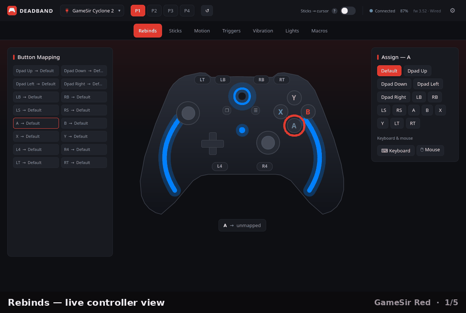

<p align="center">
  
</p>

# Deadband — a Linux configuration app for controllers and mice

A Linux GUI for gaming input devices, driven over each device's vendor (hidraw)
interface, reverse-engineered from scratch. Currently supports the **GameSir
Cyclone 2** and **G7 Pro 8K PC** controllers and the **Logitech G502 X LIGHTSPEED**
mouse (see Tested hardware); the protocol modules are per-vendor
(`vendors/gamesir`, `vendors/logitech`), so other manufacturers can be added
alongside. It covers:

- **Live input view** — sticks, triggers, all buttons (incl. the L4/R4/M/Home/
  Share extras), D-pad, battery + charging, firmware version, and a mode warning.
- **Profiles** — read the active profile and switch (1–4); rumble test.
- **Lighting** — per-light RGB, captured effect presets, brightness/speed,
  audio-reactive / pick-up-to-wake / sleep timeout, and a **custom keyframe
  animation editor** (add/remove keyframes, randomize, play/pause).
- **Config editor** — deadzones, anti-deadzones, stick trajectory, sensitivity
  curves (presets **and** a draggable custom-curve editor), trigger tuning
  (hair-trigger + response curve), vibration, poll rate, and button remap.
- **Gamepad macros** — a per-paddle (L4/R4, plus L5/R5 on the 8K) sequence
  editor with per-step hold/delay timing.
- **Motion / gyro** (G7 Pro 8K PC) — aim/tilt activation, axis setup, and curves.
- **Backup / Restore** — snapshot all 4 profiles + lighting to a JSON file and
  write it back later.
- **Mouse-mode toggle** — turn KDE/KWin's gamepad-drives-the-cursor behaviour
  off (normal gamepad) or on (sticks-as-cursor "couch mode") from the app, plus a
  non-KDE EVIOCGRAB fallback (Wayland; see Status).
- **Logitech G502 X mouse** — button remaps and keyboard bindings (with the
  G-Shift second layer and an assignable G-Shift trigger), 5-stage DPI +
  polling-rate editor, and an onboard-macro editor (build sequences or record
  them from your keyboard with live timing) — edits stage into a queue and apply
  in one verified write.
- **Demo mode** — preview one of each supported controller in software, no
  hardware connected.
- **Diagnostics** — a built-in doctor that pinpoints permission, udev, and
  hidapi-backend problems, with a copy-paste report for bug reports (see
  [Something not working?](#something-not-working)).

Every page wears your palette — six built-in theme presets (and full custom
colors). The gallery below rotates through five pages, each in a different
theme; click it (or the caption link) to step through them one at a time:

<p align="center">
  <a href="docs/screenshots/tour-1-rebinds.md">
    
  </a>
  <br>
  <em><a href="docs/screenshots/README.md">Browse the screenshot tour ▶</a></em>
</p>

**Version:** `0.2.0` — Deadband: multi-device (Cyclone 2 + G7 Pro 8K PC
controllers, G502 X mouse), the full Qt/QML app (lighting + keyframe editor,
config editor, remaps, macros, backup/restore), built-in diagnostics,
one-command install, an [AUR package](https://aur.archlinux.org/packages/deadband-git),
and a [community NixOS flake](https://codeberg.org/Epaphroditus/gamesir-linux-tools-nix).
Tracks `main` (the AUR `-git` package builds from the latest commit); last tagged
snapshot is `v0.2.0`.
**Going deeper?** The **[Manual](MANUAL.md)** is the user guide — how to use each
feature, troubleshooting & recovery, and an FAQ. **[RESEARCH.md](RESEARCH.md)** is the
developer side — protocol, architecture, the diagnostic tools, and per-controller
findings. See also **[CONTROLLER_MAP.md](CONTROLLER_MAP.md)** (what each control
reports to Linux) and **[TODO.md](TODO.md)** (roadmap + open questions).

This is a hobby reverse-engineering project; fork it and customize it however you like.

> ### ⚠️ Tested hardware
> Everything here has only been developed and verified on a **GameSir Cyclone 2**,
> a **GameSir G7 Pro 8K PC**, and a **Logitech G502 X LIGHTSPEED** mouse — **nothing
> else.** (A regular, non-8K **G7 Pro** was also tested but does **not** work: it's
> an Xbox-only pad whose config channel Linux doesn't expose — input works, config
> is blocked. See [RESEARCH.md](RESEARCH.md).)
> Other GameSir controllers, other Logitech mice, other dongles, and firmware
> revisions we haven't seen are **unsupported and untested** and may misbehave. The
> app won't send config writes to a device it can't positively recognize, but
> please don't treat it as proven-safe on hardware it has never seen. Use it at
> your own risk.

## The app

**`deadband.py`** — the **Qt/QML app** (PySide6): a polished, KDE-native UI over
the reverse-engineered core, with a live controller render, per-zone RGB +
keyframes, stick/trigger curves, button remap, macros, vibration,
backup/restore, and a mouse-mode toggle. A device picker in the header switches
between your controllers and the G502 X, which gets its own Buttons / DPI /
Macros tabs.

## Install

Deadband needs Python 3 with [`PySide6`](https://pypi.org/project/PySide6/) and
[`hidapi`](https://pypi.org/project/hidapi/) — hidapi built with its **hidraw**
backend. Each route below takes care of that unless noted.

### Arch Linux

Install [`deadband-git`](https://aur.archlinux.org/packages/deadband-git) from
the AUR:

```sh
yay -S deadband-git      # or: paru -S deadband-git
```

It's a `-git` package, so it always builds the latest commit. To build without
an AUR helper, use the included [`packaging/PKGBUILD`](packaging/PKGBUILD):

```sh
cd packaging && makepkg -si
```

### NixOS

Use the community flake by
[Epaphroditus](https://codeberg.org/Epaphroditus) —
[`gamesir-linux-tools-nix`](https://codeberg.org/Epaphroditus/gamesir-linux-tools-nix).
Its NixOS module sets up the udev permissions declaratively and builds `hidapi`
with the hidraw backend. To try it without installing:

```sh
nix run codeberg:Epaphroditus/gamesir-linux-tools-nix
```

### Any distro (installer script)

1. Install the dependencies. On Arch:
   `sudo pacman -S --needed python pyside6 python-hidapi`. Elsewhere:

   ```sh
   pip install --user PySide6
   HIDAPI_WITH_HIDRAW=1 pip install --user --no-binary :all: hidapi
   ```

   `HIDAPI_WITH_HIDRAW=1` matters: pip's source build otherwise selects the
   libusb backend, which can't open the devices. Building needs `gcc`, the
   Python headers, and libudev (Fedora/Bazzite: `systemd-devel`;
   Debian/Ubuntu: `build-essential python3-dev libudev-dev`).

2. Clone and install:

   ```sh
   git clone https://github.com/broroeror/gamesir-linux-tools.git
   cd gamesir-linux-tools
   ./install.sh
   ```

`install.sh` installs to your home directory (`~/.local`) and verifies your
hidapi backend. The only privileged step is the optional one-time udev rule —
the script shows the exact commands and asks first; declining still installs
the app, it just can't reach the controller until the rule is in place.
Afterwards **Deadband** is in your app launcher (or run `deadband`). To remove
it, run `./uninstall.sh`. Upgrading from the old `gamesir-cyclone2` install?
`install.sh` cleans it up, and your settings carry over on first run.

## Running

Put the controller in **Xbox / XInput mode** (use the Start / pause buttons).
The vendor protocol is inert in PS4/DS4 and Switch modes — the app's header
warns you when you're in the wrong one.

**Grant device access (recommended, once):**

1. From the repo directory, install the udev rule — it's scoped to GameSir's
   USB vendor id, nothing else:

   ```sh
   sudo cp 70-gamesir.rules /etc/udev/rules.d/
   sudo udevadm control --reload-rules && sudo udevadm trigger
   ```

2. Start the app — no replug needed:

   ```sh
   python3 deadband.py
   ```

To configure the **G502 X mouse**, install its rule the same way (the app's
mouse page also shows these commands):

```sh
sudo cp packaging/udev/70-deadband-g502x.rules /etc/udev/rules.d/
sudo udevadm control --reload-rules && sudo udevadm trigger
```

To verify access: `getfacl /dev/hidraw0` should show a `user:<you>:rw-` line.

How the rule works:

- It uses `TAG+="uaccess"`, which grants access to the user logged in at the
  local desktop.
- The `70-` filename prefix matters: udev applies the `uaccess` ACL in
  `73-seat-late.rules`, so a rule numbered `73` or higher sets the tag too
  late and access is silently never granted.
- On a headless box with no local seat, `uaccess` doesn't apply — use
  `MODE="0660", GROUP="input"` instead and add yourself to that group.

**Fallback — run as root.** Without the rule, the `hidraw` nodes are
root-owned:

```sh
sudo python3 deadband.py
```

Under `sudo`, `~` resolves to `/root`, so backups land there — another reason
to prefer the udev rule.

## Something not working?

Open **Settings → Help & Diagnostics** in the app, or run `deadband --doctor`
in a terminal (works over SSH). The doctor checks whether the app can actually
*open* your devices — the classic failure is a controller that's detected but
never connects — and names the exact problem: a missing or un-applied udev
rule, a Python `hidapi` built with the libusb backend, and so on, with fix
commands for your distro (NixOS included). Use **Copy report** to paste the
result into a GitHub issue. The app shows the same guidance in a banner
whenever it finds a device it can't open.

## Safety

Short version: this app changes controller **settings**, not firmware, and
everything it does is **reversible** and stays **on your machine**. The specifics:

- **What it writes.** Edits go to the controller's *config* registers — deadzones,
  curves, button remaps, vibration, poll rate, and lighting — over the vendor
  channel, the same settings the official app changes. Writes **auto-persist** to
  the controller (there's no separate "commit" step), but they're ordinary config,
  not firmware — nothing here touches the bootloader.
- **Back up before you experiment.** **Backup / Restore → Export** snapshots all
  four profiles + lighting to a JSON file; **Restore** writes it back. Take one
  before you start changing things and you can always return to a known-good state.
  Restore is write-verify-retry and reports a clear pass/fail. Imported backups are
  **validated against the controller's known register map before any write**, so a
  hand-edited or corrupt file can't drive writes to arbitrary registers.
- **Reversibility.** Every setting the editor exposes can be set back the same way
  it was changed. The worst realistic outcome of experimenting is a profile that
  feels wrong — fixed by Restore, re-editing, or the controller's own factory-default
  reset.
- **Xbox / XInput mode only.** The vendor protocol is inert in PS4/DS4 and Switch
  modes — there the app can't reach the controller, so it can't change anything.
  Use the Start / pause buttons for Xbox mode (the header warns you when you're not in
  it).
- **No network.** No telemetry, no account, no phone-home — it's all local USB. Even
  the firmware *version* is read straight from the USB descriptor, not fetched
  online.
- **Permissions.** Prefer the udev rule (per-user `uaccess`) over running as root —
  see [Running](#running). Under `sudo`, `~` is `/root`, so backups land there.
- **Tested hardware.** Only the Cyclone 2 and G7 Pro 8K PC (see the note up top). Treat
  anything else as unproven and use it at your own risk.

## How it works

The controller exposes a **vendor HID interface** (USB VID `0x3537`) with a 64-byte
command channel. In **Xbox mode**, with a sustained heartbeat, it streams input
(enhanced report `0x12` — sticks, triggers, IMU, battery, and the L4/R4/M paddles the
standard report can't see) and accepts **register read/write** commands for config and
lighting. The firmware *version* is read from the USB `bcdDevice` descriptor — no
command, no network.

For what each control reports to Linux as a normal gamepad, see
**[CONTROLLER_MAP.md](CONTROLLER_MAP.md)**. The full command set, the lighting/keyframe
register encoding, the app's architecture, and the per-controller findings (including
the G7 Pro) live in **[RESEARCH.md](RESEARCH.md)**.

## File layout

The app is split into focused modules — the connect/read loop, the shared `state`,
the command channel, and the lighting/config/backup domains. That structure and the
`research/` diagnostic scripts are documented in **[RESEARCH.md](RESEARCH.md)**
(Architecture + Methodology & tools). One-off probes and the pre-refactor monolith
live in **`archive/`**.

## Status

**Working:** live input, battery, firmware readout, Xbox-mode warning, profile
read/switch, rumble, full per-light RGB + effect presets + lighting power settings, a
**custom keyframe animation editor** (1–8 frames, play/pause), a **config editor**
(deadzones, anti-deadzones, stick trajectory + sensitivity curves incl. a draggable
custom-curve editor, trigger tuning, vibration, poll rate), **button remap**,
**per-paddle gamepad macros** (read-back-verified writes), **8K motion/gyro**, and
**backup / restore** — all verified end-to-end on hardware. Restore is
write-verify-retry; only the active profile + lighting are guaranteed (banks
`0x02`–`0x04`, the stored profiles, appear read-only on this controller).

**Mouse (G502 X):** remaps, keyboard bindings, the G-Shift layer + trigger, DPI
stages, report rate, and the onboard-macro editor are verified on hardware —
including keystroke recording with live timing, macros long enough to chain
across several flash sectors, and the scroll / media / F13–F24 step types.
Because flash can't be rewritten in place, re-assigning a macro strands its old
sector; an apply now sweeps stranded sectors automatically, so editing a
button's macro costs no net slots (there's a manual sweep on the Macros tab
too). Macro playback runs slightly slower than recorded — the mouse's macro
engine spends a little time per step.

**Mouse-mode gotcha (KDE Plasma 6.7):** after a dongle replug, the sticks may start
driving the desktop cursor — that's **KWin's Game Controller plugin** reading the
joystick node directly, not the controller emulating a mouse. Turn it off:

```sh
kwriteconfig6 --file kwinrc --group Plugins --key gamecontrollerEnabled false
qdbus6 org.kde.KWin /KWin reconfigure   # or log out/in
```

The app also has an in-app **Stop mouse mode** toggle (desktop-agnostic fallback);
see [Troubleshooting](MANUAL.md#troubleshooting--recovery) for the full picture.

**The config register map** (banks, offsets, remap records, the inferred RT block)
and the **open items** — verifying the RT block, some remap target codes,
profile-switch sync, PS4/Switch input parsing — live in
**[RESEARCH.md](RESEARCH.md)** and **[TODO.md](TODO.md)**.

## Firmware

The Cyclone 2's firmware can be **backed up and restored** from Linux — an advanced,
opt-in, Cyclone-2-only feature (wired connection only, never over the 2.4 GHz dongle).
It's a backup/restore tool, **not** a firmware updater, and it needs the external
[jl-uboot-tool](https://github.com/kagaimiq/jl-uboot-tool) (not bundled). See
**[FIRMWARE.md](FIRMWARE.md)**.

## License & disclaimer

Released under the [MIT License](LICENSE) — use, modify, and redistribute
freely.

This is an independent, hobby reverse-engineering project. It is **not
affiliated with, endorsed by, or supported by GameSir**, and "GameSir" and
"Cyclone 2" are trademarks of their respective owners. The protocol was
reverse-engineered for interoperability, and the repository contains **no vendor
firmware or USB captures**. Provided **as is, without warranty** — you use it, and
poke at your controller, at your own risk.
