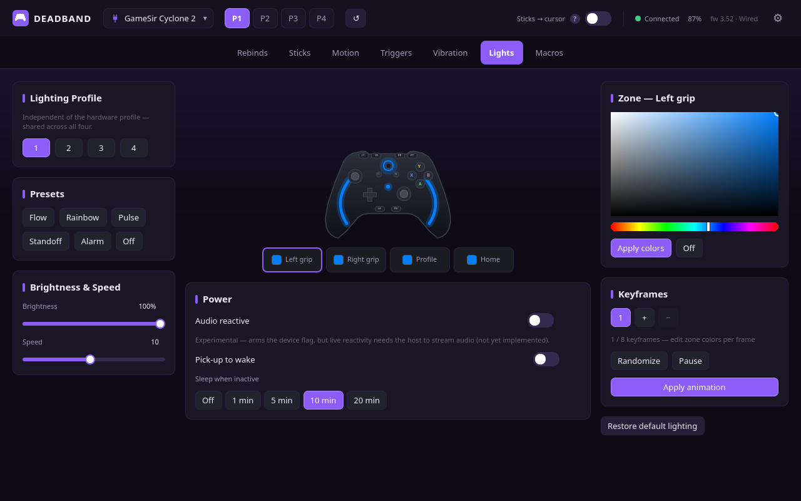
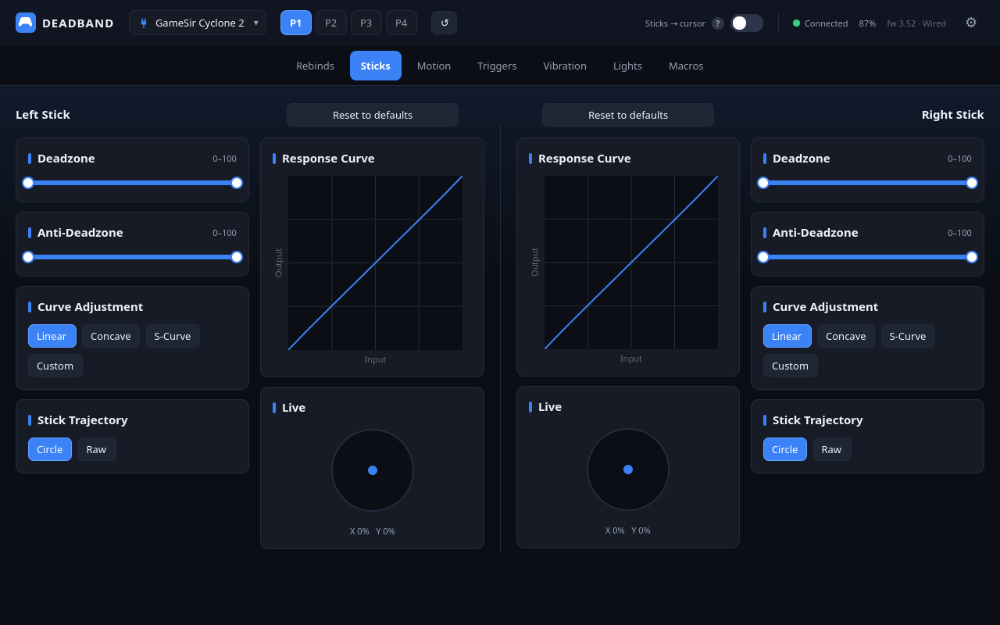
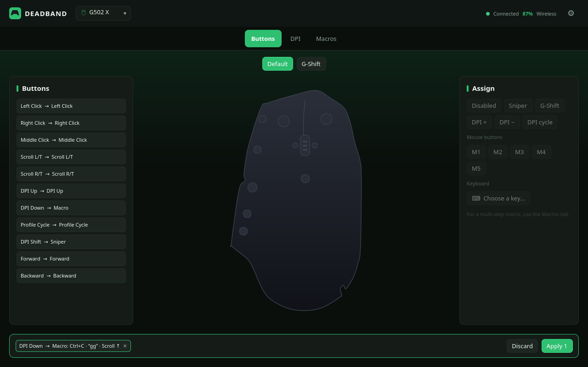
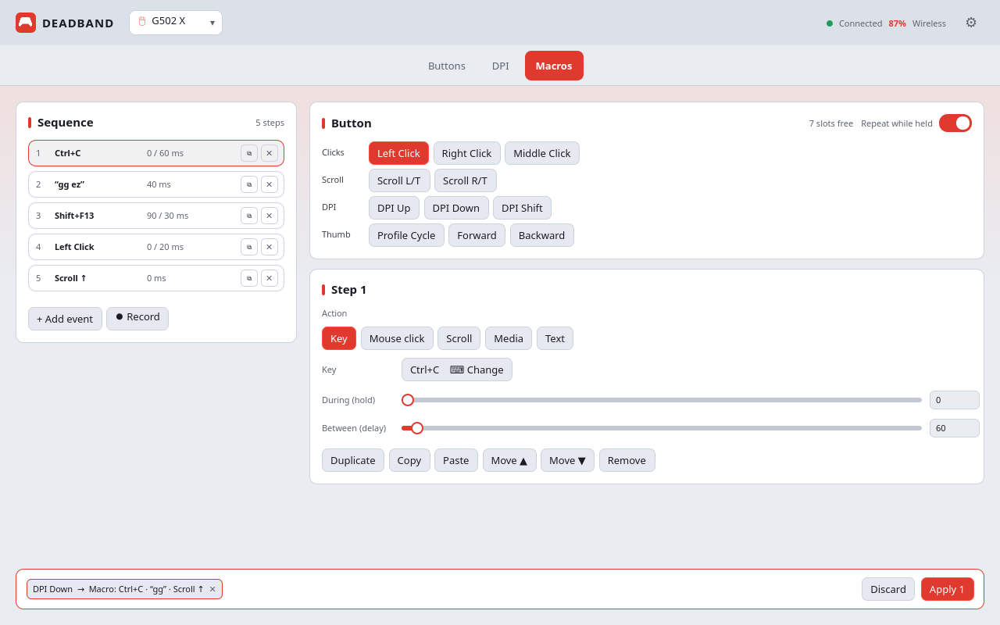

# Deadband — screenshot tour

Every shot below is the real app rendered page by page, each wearing a
different one of the six built-in theme presets (Settings → Theme; every color
is also individually customizable). Data shown via demo mode — no two
controllers were harmed in the making.

## Rebinds — *GameSir Red* (default theme)

The live controller view: pick any button on the render or the list, assign a
gamepad button, keyboard key, or mouse action.

## Lighting & keyframes — *Violet*

Per-zone RGB with a full color picker, captured effect presets, brightness /
speed / power settings, and the custom keyframe animation editor.

## Stick curves — *Cobalt*

Deadzones, anti-deadzones, trajectory, and sensitivity curves — presets or a
draggable custom curve, per stick.

## G502 X buttons — *Emerald*

The mouse side: click a button on the diagram, assign clicks, keys (with the
G-Shift second layer), sniper, or DPI steps — edits stage into a queue and
apply in one verified write.

## Mouse macros — *Slate (light)*

The onboard-macro editor: build a sequence step by step or record it from your
keyboard with live timing, tune each step's hold/delay, then Apply.

