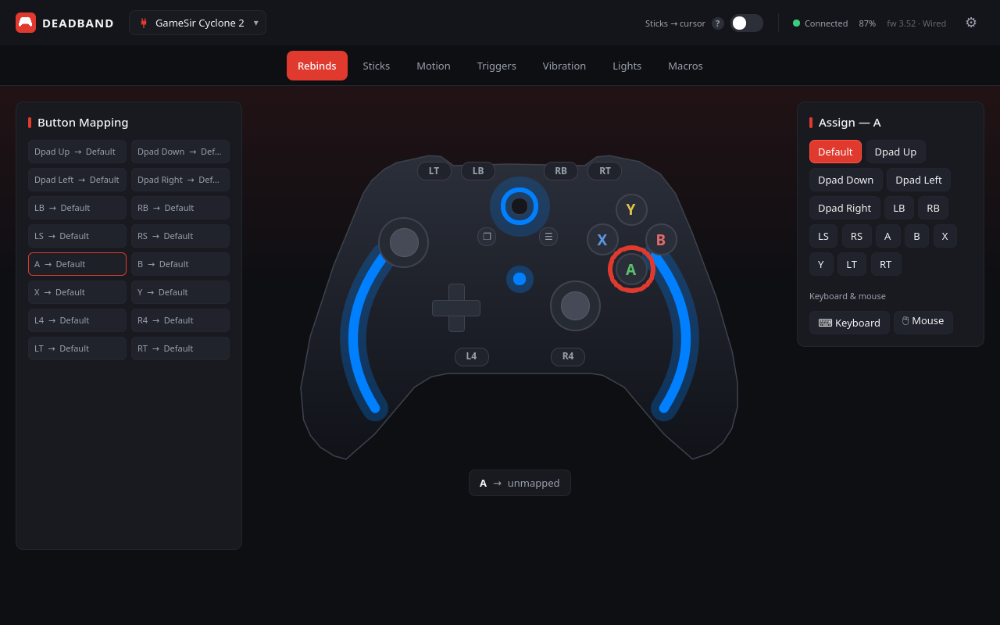

# 1 / 5 — Rebinds — live controller view

*Theme: **GameSir Red (default)***

[◀ G502 X — onboard macro editor](tour-5-mouse-macros.md) · [Tour index](README.md) · [Lighting & keyframe animations ▶](tour-2-lights.md)

Pick any button on the render or in the list, then assign a gamepad button, keyboard key, or mouse action.

[◀ Previous](tour-5-mouse-macros.md) · [Tour index](README.md) · [Next ▶](tour-2-lights.md)
